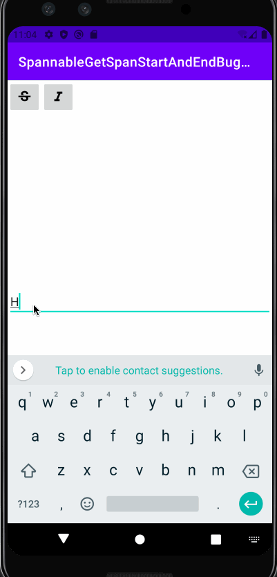
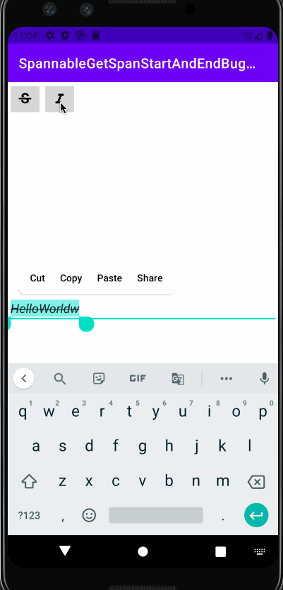
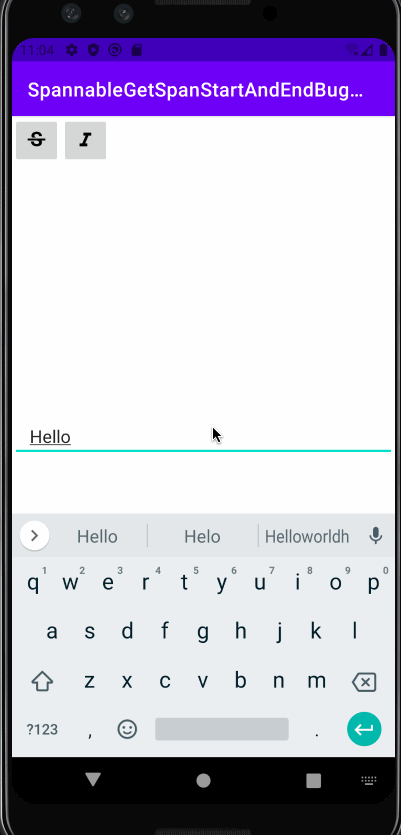

This app is meant to illustrate a bug we have found with `Spannable`. A user will type in text into an `EditText`, assign styles to a span, and then upon either entering a character at the very end of the span or backspacing the last span the entire span will become all styles that have been applied whether or not they have been applied to those characters. If you notice the logs upon adding the character at the end or backspacing that the start and end points provided by `getSpanStart` and `getSpanEnd` return the entire length of the text though styles may have only been applied to a smaller portion of the text. 

This is a bug because the expectation would be that the discrete sub spans created within the parent span would maintain their integrity upon editing the end of a span, as it should only effect the sub span at the end of the parent span.

**Other important pieces of information:**
1. on some emulated devices the bug does not exist when using a physical keyboard. However it's always reproducible by using the emulator's IME keyboard.
2. It's worth mentioning that though this demo uses the `Spannable.SPAN_INCLUSIVE_INCLUSIVE`  flag for setting spans, there is also a bug with setting the spans with the `Spannable.SPAN_EXCLUSIVE_EXCLUSIVE` flag. By using the latter flag, adding a character, or backspacing at the end of a span that has two separate style spans within it will cause the child spans to be removed from the parent span.

***Here are the following steps to reproduce:***
1. type in a word in the `EditText` field (ex. HellWord). This word is the parent span
2. highlight a portion of the word and press one of the style buttons at the top of the screen, very important that its's only a portion of the text and not the whole text typed in.
3. highlight the remaining characters that have not been styled and apply the style you have not used by clicking it's respective button
4. add a character at the end of the word you have styled or backspace at the end and observe the whole word becoming both styles

***Screen Recording:***

You may also delete formats by tapping on the same style button on a section of text with that style for your convenience

Aforementioned bug with `Spannable.SPAN_EXCLUSIVE_EXCLUSIVE`

